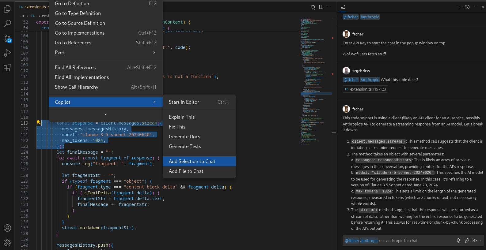

# Ftcher - fetches stuff
### Github copilot chat extension

It adds the `claude-3-5-sonnet` into the [copilot](https://github.com/features/copilot) chat.



Example of usage: ```@ftcher /anthropic your prompt here```

Also you can use copilots features like:
- add selection to chat 
- add file to chat 

First call will ask for anthropic api key that you can get at [https://www.anthropic.com/api](https://www.anthropic.com/api)

To package this extension and load it as .vsix file to vscode extensions. 
- first install ```npm install -g @vscode/vsce``` 
- then run  ```npx @vscode/vsce package```
- finally right click on the generated .vsix file, then click the `Install extension VSIX` on the bottom or go to extensions menu, click three dots and tap install.

Or run in debug mode.


Useful links:
- [https://code.visualstudio.com/api/extension-guides/chat](https://code.visualstudio.com/api/extension-guides/chat)

- [https://github.com/features/copilot](https://github.com/features/copilot)

- [https://code.visualstudio.com/](https://code.visualstudio.com/)

- [https://www.anthropic.com/api](https://www.anthropic.com/api)
